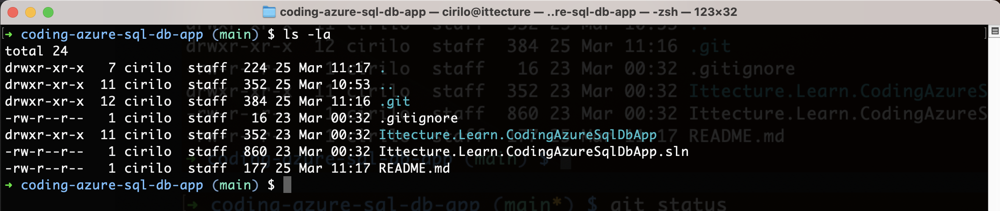
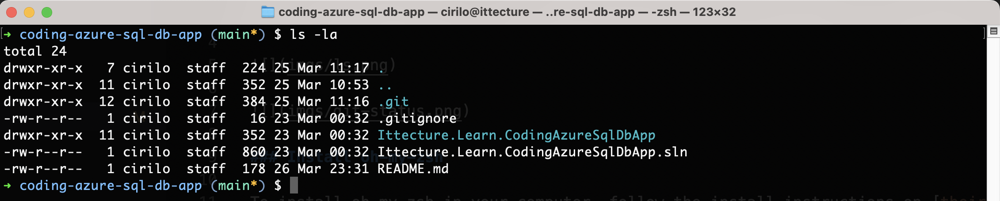

# Ittecture Theme for oh-my-zsh

This is the theme we use on our MacOS terminal that can be seen in our videos on YouTube.





### Install oh-my-zsh

To install oh-my-zsh in your computer, follow the install instructions on [their website](https://ohmyz.sh/#install).

### Copy the Ittecture theme

After installing oh-my-zsh, copy the ittecture.zsh-theme file to the oh-my-zsh themes folder. 

```bash
$ cd ~/.oh-my-zsh/themes
```

### Change the theme

1. The next step is to tell oh-my-zsh that you want to use the ittecture theme. This setting is stored in the .zshrc file.

```bash
$ sudo nano ~/.zshrc
```

2. Find the ZSH_THEME key and set to ittecture. The name should match the file name without the ".zsh-theme" extension.

```bash
ZSH_THEME="ittecture"
```

3. Save the .zshrc file.

Restart the terminal.